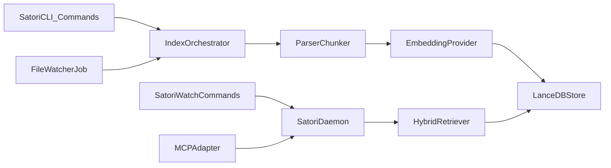

# Architecture V1.1: Local Memory Pack (Command-First)

> Legacy spec note: this architecture references older `satori` naming and LanceDB-centric flows.
> Current implementation is `memkit` (`mk`) with Helix-backed local storage.

## System Overview

V1.1 is a local-first Rust system with three runtime surfaces:

- Command-first CLI for setup, indexing, serving, watch lifecycle, and diagnostics.
- Daemon for query and watch workflows.
- MCP adapter for AI client integration.
- TUI is optional and non-normative.
- FalkorDB runs as a managed native sidecar provisioned by local runtime scripts.

## Component Diagram

## Retrieval Flow

1. Receive query through daemon or MCP.
2. Embed query using `EmbeddingProvider`.
3. Run vector retrieval from LanceDB.
4. Run FTS/BM25 retrieval from LanceDB.
5. Fuse/rerank results with deterministic sort tiebreak.
6. Return top-k chunks with citation metadata.

## Ingestion Flow

1. Scan configured source roots with include/exclude globs.
2. Parse and chunk files into normalized units.
3. Compute content hashes and compare against `state/file_state.json`.
4. Embed only new/changed chunks.
5. Upsert rows into `chunks` table and refresh indexes as required.
6. Persist file state checkpoint.
7. Watch lifecycle is controlled by explicit start/stop commands and reflected in daemon status.

## Core Dependencies

- Rust async runtime: `tokio`
- Storage/index: `lancedb`
- Embeddings (primary): `fastembed`
- Embeddings (fallback): `ort` + tokenizer stack
- Watcher: `notify`
- Serialization: `serde`, `serde_json`
- Error handling: `thiserror` and/or `anyhow`

## ONNX Strategy

- Keep ONNX inference local and in-process.
- Default provider is `fastembed` for integration speed.
- Keep `EmbeddingProvider` trait boundary to allow fallback to direct `ort`.
- Pin model version and checksum for reproducibility.

## LanceDB Decision Gate

LanceDB is selected only if all of the following pass:

- No blocking instability in ingest/update/query/reopen loops.
- Hybrid search path functions end-to-end in Rust.
- Portability test passes across environments.
- Meets PRD latency and reindex budgets.

If not passed, fallback is `sqlite-vec` + separate keyword index while preserving pack format contract.

## Deployment Modes

### Local

- Single daemon process on user machine plus managed Falkor sidecar process.
- Local filesystem pack + local model cache.

### Cloud/Server

- Same daemon binary in container/VM.
- Persistent volume for pack and model cache.
- Optional object storage sync outside V1 scope.

## Observability

- Structured logs for ingest/query/watch.
- Timing spans for embed, retrieval, rerank, and total.
- Health and status endpoints expose freshness, watcher lifecycle state, and failure state.
